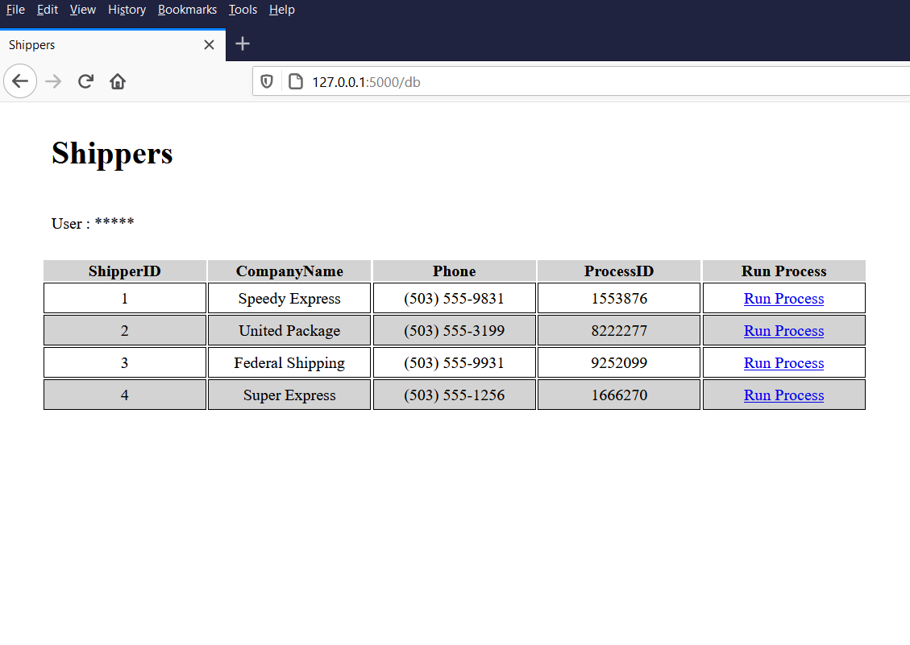
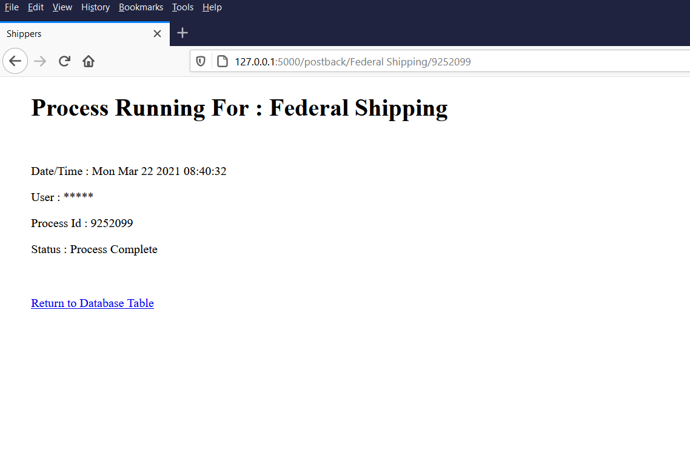

# NorthwindFlask
Demonstration of using Flask and SQL Server

This shows an example of referencing the Northwind database through Python and Flask to show the data and to initiate Python processes through a web page.

